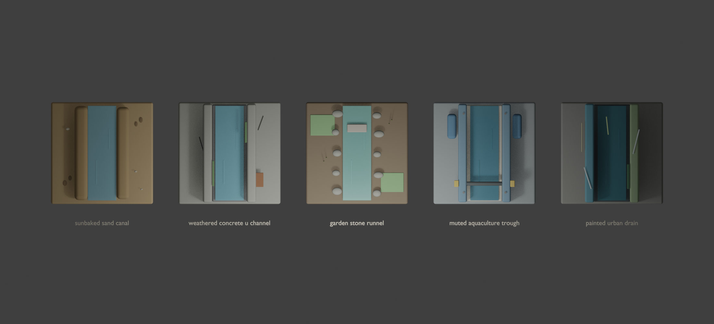

# フェーズ0B 水路パーツ評価メモ

作成日時: 2026-05-15 JST  
対象: 直線1マス水路の見た目比較  
作業範囲: Blenderで5種類の試作を作成し、FBX/GLB/Blend/プレビュー画像を出力

## 成果物

プレビュー:



出力先:

```text
blender/exports/phase0_waterway_variants/
```

個別出力:

| 種類 | FBX | GLB |
| --- | --- | --- |
| Sunbaked Sand Canal | `sunbaked_sand_canal.fbx` | `sunbaked_sand_canal.glb` |
| Weathered Concrete U-Channel | `weathered_concrete_u_channel.fbx` | `weathered_concrete_u_channel.glb` |
| Garden Stone Runnel | `garden_stone_runnel.fbx` | `garden_stone_runnel.glb` |
| Muted Aquaculture Trough | `muted_aquaculture_trough.fbx` | `muted_aquaculture_trough.glb` |
| Painted Urban Drain | `painted_urban_drain.fbx` | `painted_urban_drain.glb` |

Blender編集用:

```text
blender/exports/phase0_waterway_variants/phase0_waterway_variants.blend
```

生成スクリプト:

```text
blender/scripts/generate_phase0_waterway_variants.py
```

## 評価サマリー

今回の目的は、完成品を作ることではなく、方向性を比較できる材料を作ること。全て同じ「直線1マス水路」にして、見た目だけを変えた。

### 1. Sunbaked Sand Canal

砂を掘って水路を作った方向。SandCastle寄りの候補。

良い点:

- AquaPlayの玩具感から離れやすい。
- 砂、水、手作り感の相性がよい。
- 今後、貝殻・小石・足跡・湿った砂などで味を足しやすい。

気になる点:

- 現状は水と砂の境界がやや単純。
- 遠目だと「砂で掘った感じ」がまだ弱い。

次に伸ばすなら:

- 水際をもっと不規則にする。
- 乾いた砂、湿った砂、崩れた砂の差を強める。
- 小物を増やしすぎず、手作業の跡を増やす。

### 2. Weathered Concrete U-Channel

古びたコンクリートのU字水路。ノスタルジックで現実寄りの候補。

良い点:

- 水路としての読みやすさが高い。
- AquaPlayの直接コピーに見えにくい。
- 苔、ひび、補修跡などで「古い水路」感を伸ばしやすい。

気になる点:

- 暗く・重くなりすぎると遊び心が減る。
- 現状はまだ整いすぎていて、生活感や懐かしさは追加が必要。

次に伸ばすなら:

- 角の欠け、ムラ、汚れ、苔を増やす。
- ただし水路の接続口は見やすく保つ。

### 3. Garden Stone Runnel

石組みと庭の細い水路。癒し・ジオラマ寄りの候補。

良い点:

- 見た目の雰囲気がやわらかい。
- 庭、苔、草、踏み石、橋などへ展開しやすい。
- 将来の「水を流すと植物が元気になる」表現と相性がよい。

気になる点:

- 石や草が増えると水路の経路が見づらくなる可能性がある。
- 砂やコンクリートに比べると、ゲーム的な接続マス感が弱くなる。

次に伸ばすなら:

- 石の密度を整理する。
- 水路の入口と出口に、接続口として読める形を入れる。

### 4. Muted Aquaculture Trough

養殖・水処理設備風の実用水路。

良い点:

- ポンプ、水車、配管、フロートなどの将来ギミックに繋げやすい。
- 水を動かす装置としての説得力がある。
- 玩具ではなく実用品として見せられる。

気になる点:

- 今回の5つの中ではやや工業寄り。
- 色の扱いを間違えるとAquaPlayの青黄プラスチックに近づく。

次に伸ばすなら:

- 青と黄色をさらにくすませる。
- 金属・ゴム・古いプラ素材の質感を足す。
- ゲーム本編ではメイン水路より、ポンプや水車周辺に使う方が合うかもしれない。

### 5. Painted Urban Drain

塗装された都市排水路・古い水路の方向。

良い点:

- 個性が強い。
- ユーザー提示画像の「古い壁・水路・ペイント」の雰囲気に近い。
- ノスタルジックで少しアート寄りにできる。

気になる点:

- 現状は暗く、他の候補より重い。
- ペイント線が増えると、実際の水流と混ざって読みにくくなる。

次に伸ばすなら:

- 暗さを抑え、退色した青緑や日差しを増やす。
- ペイントは水流の方向を助ける程度にする。

## 現時点のおすすめ

一番バランスが良さそうなのは、次の2方向。

1. **Weathered Concrete U-Channel**
   - 水路として一番読みやすい。
   - AquaPlayの版権・玩具感から離れやすい。
   - ノスタルジック方向に伸ばしやすい。

2. **Sunbaked Sand Canal**
   - SandCastle的な希望に一番近い。
   - もっと手作り感を足すと、Aqua_Playらしい独自性が出そう。

混ぜるなら、**砂の地形 + 古いコンクリートの水路 + ところどころ庭石や苔**がよい。  
これなら「砂場の遊び」「古い水路の懐かしさ」「庭の小さな世界」が同時に成立する。

## 次の議論ポイント

- メイン方向は「砂」か「古いコンクリート」か、それとも混合にするか。
- 見た目はもっとリアル寄りにするか、もっとジオラマ寄りにするか。
- 養殖設備風はメイン水路に使うか、ポンプ・水車などのギミック専用に回すか。
- Painted Urban Drainのような暗めの方向を残すか、今回は候補から外すか。

このフェーズではここで止め、ユーザー確認後に次の作業へ進む。
